# Plötzlich gelernt  
## Visualisierung des Lernens kleiner neuronaler Netze bei modularer Addition

---

<!-- ===================================================== -->
## 1. Motivation & Forschungsfrage

Das Verständnis von Lernprozessen in künstlichen neuronalen Netzen steht oft vor dem Rätsel der Generalisierung. Ein besonders faszinierendes Phänomen ist hierbei das sogenannte **Grokking**. Dieses Phänomen kann als Beispiel für Kipppunkte (Tipping Points) und "Phasenübergänge" in Lernprozessen, wenn wenn dies als "komplexe Systeme" betrachtet werden. Aus der Perspektive der mathematischen Physik finde ich das „Lernen” neuronaler Netze äußerst ansprechend.

Die Frage, zB. wie ein diskretes algebraisches Problem (modulare Arithmetik) in eine kontinuierliche, geometrische Repräsentation im Embedding-Raum überführt wird, bildet den Kern dieser Untersuchung.
Um dieses Konzept greifbar zu machen, lässt sich eine Analogie zum Lesen einer analogen Uhr ziehen:

> Ab wann "kapiert" ein Modell – mit nur wenigen Beispielen, aber großer Geduld – wie man eine Uhr liest, unabhängig vom spezifischen Zifferblatt?

### 1.1 Zentrale Forschungsfrage als Inspiration meines kleinen Projektes 
Wann ist ein neuronales Netz in der Lage, eine modulare Addition nicht nur auswendig zu lernen (Memorization), sondern die zugrunde liegende mathematische Logik wirklich zu **verstehen** (Generalization)?

### 1.2 Abweichung vom Standard-Train/Test-Paradigma

In klassischen Machine-Learning-Setups wird häufig eine Train/Test-Aufteilung von etwa 70/30 % verwendet. In solchen Szenarien konvergieren Modelle meist schnell, da sie genügend Beispiele sehen, um statistische Muster effizient zu approximieren. Auch in meinen frühen Experimenten zeigte sich: Bei einer klassischen Aufteilung (z. B. für $P=97$ mit 70/30 %) erreichte das Modell rasch hohe Accuracy-Werte – jedoch primär durch statistisches Auswendiglernen der Trainingsdaten, ohne die zugrunde liegende mathematische Struktur tatsächlich zu erfassen.

<!-- "../" um zu dem Ornder oben zu wechseln-->
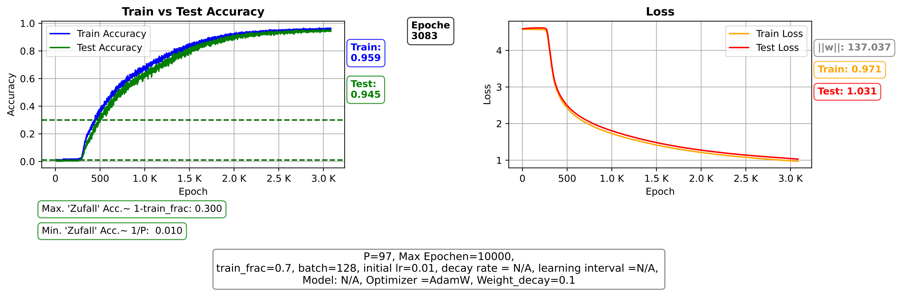 
*Abbildung 1: Beispiel für eine Standard Situation: 70% Trainings/ 30% Testsdatensatz*

In diesem Projekt haben wir den gegenteiligen Ansatz: Durch eine drastische Reduktion der Trainingsdaten wird das Modell gezwungen, über reine Memorization hinauszugehen und die zugrunde liegende Regel zu abstrahieren. Ein zentrales Ziel dieses Projekts bestand daher darin, ein geeignetes Datenfenster zu finden, in dem Generalisierung überhaupt auftreten kann. Empirisch zeigte sich ein kritischer Bereich von etwa 18–35 % Trainingsdaten, in dem sich reproduzierbare Grokking-Effekte beobachten ließen.


<!-- "../" um zu dem Ornder oben zu wechseln-->
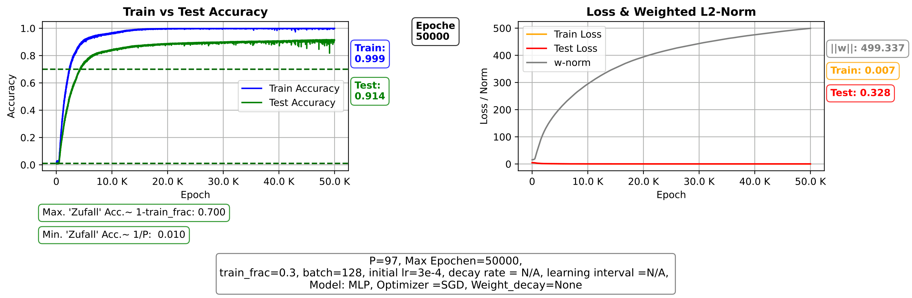 
*Abbildung 2: Links: Dies ist ein Beispiel für unsere Situation mit einem 30-% Training-/70-% Testdatensatz.
Rechts: Das Wachstum der Weight Norm (siehe Abschnit 6. unten) wird gemeinsam mit den Los-Funktionen angezeigt.*

<!-- ===================================================== -->
## 2. Projekt-Roadmap  & Leserführung
## 2.1 Zielsetzung des Projekts
Hier wird meine persönlichen, methodischen und technischen Zielsetzungen für das Projekt.
Die strukturelle Entwicklung des Modells und die experimentelle Reise werden hingegen in Kapitel 4 dargestellt. Dieses Projekt verfolgt folgende Kernziele:

- **Modellentwicklung & Visualisierung:** Schrittweise Erstellung eines vereinfachten NN-Modells in Python (Keras), CPU-trainierbar, zur Darstellung des Generalisierungsübergangs.
- **Intuitionsaufbau:** Entwicklung eines tieferen Verständnisses für die Dynamik von Trainingsprozessen: Tunning der Hyperparameter.
- **Skill-Development:** Praktische Vertiefung meiner Python-Kenntnisse im Bezug auf ML und Deep Learning als Einstieg in Data Science. 
- **Projektdokumentation:** Bei dieser Arbeit handelt es sich um eine eigenständige Python-Implementierung. Sie orientiert sich an zentralen Publikationen der KI-Forschung, insbesondere an den Untersuchungen zu Grokking von Power et al. (2021) und Nanda et al. (2023). Als methodische Übung wurde die gesamte Softwareumgebung eigenständig entwickelt; der Code stellt somit eine unabhängige Eigenleistung dar und greift nicht auf die Skripte der genannten Referenzen zurück.


## 2.2 Projekt-Roadmap

Dieses Projekt folgte keinem linearen Entwicklungsprozess, sondern einer iterativen empirischen Reise. Mehrere Modellvarianten, Datenrepräsentationen und Trainingsregime wurden getestet, verworfen und weiterentwickelt. Die folgende Roadmap dient als Orientierung für die nachfolgenden Kapitel und beschreibt die zentrale Entwicklungslinie.

### Entwicklungsphasen

1. **Klassisches Setup & Baseline (MLP + Skalierung)**  
   Ausgangspunkt war ein klassisches MLP mit skalierten numerischen Eingaben. Trotz langer Trainingszeiten und zahlreicher Optimizer-Varianten blieb das Modell in Memorization gefangen und zeigte keine Generalisierung.

   > **Forschungs-Notiz zur Baseline:** In dieser Phase zeigte sich eine wichtige theoretische Erkenntnis: Klassisches Feature-Scaling (Division durch $P$) suggeriert dem Modell eine numerische Nachbarschaft, die in der modularen Arithmetik nicht existiert ($P-1$ ist algebraisch direkt neben $0$, numerisch aber maximal entfernt). Das Scheitern dieser Phase war der Beweis, dass das Modell keine Kurve approximieren, sondern eine diskrete Symmetrie lernen muss.


2. **Datenrepräsentation als Wendepunkt**  
   Die Einsicht, dass modulare Arithmetik eine zyklische Struktur besitzt, führte zum Wechsel von skalierter Numerik hin zu diskreten Kategorien und Embeddings.

3. **Relationale Modellierung durch Attention**  
   Durch die explizite Modellierung von Wechselwirkungen zwischen Operanden konnte das Modell beginnen, Beziehungen statt isolierter Werte zu lernen.

4. **Hybrid-Architektur (Embedding + Attention + MLP)**  
   Die Kombination relationaler Strukturverarbeitung mit klassischer nichtlinearer Transformation erwies sich als stabiler Ansatz zur Generalisierung.

5. **Grokking & Phasenübergang**  
   Unter stark reduzierter Trainingsdatenmenge zeigte das Modell lange Memorization-Phasen, gefolgt von abrupten Generalisierungssprüngen – interpretierbar als strukturelle Phasenübergänge im Parameterraum.

### Interpretationsrahmen

Die gesamte Entwicklung wird sowohl aus einer Machine-Learning-Perspektive (Loss, Accuracy, Architekturentscheidungen) als auch über physikalische Analogien interpretiert, insbesondere:

- Memorization → ungeordneter Zustand  
- Regularisierung → Abkühlungsprozess  
- Grokking → Phasenübergang  
- Embedding-Struktur → Kristallisation stabiler Repräsentationen


---

<!-- ===================================================== -->
## 3. Datensatz & Mathematische Problemdefinition

Für die Experimente wurde eine modulare Additionstabelle konstruiert.

### Struktur
Datensätze der Form `[a, b, c]`, wobei
$$
c = (a+b) \mathop{mod} P
$$
und die Modul-Parameter sind Primzahlen hier:
- `P = 97`
- `P = 29`
um klare algebraische Strukturen ohne triviale Submuster zu gewährleisten.

### Implementierung der Problemdefinition

```python
# Generierung des vollständigen Datensatzes
for a in range(P):
    for b in range(P):
        xs.append([a, b])
        ys.append((a + b) % P)
```

<!-- ===================================================== -->

## 4. Empirische Modellentwicklung

Der Weg zur finalen Architektur war ein iterativer Prozess, geprägt von der Wahl der Datenrepräsentation (Skalierung vs. Embeddings), der schrittweisen Anpassung des neuronalen Netzmodells sowie intensiver Hyperparameter-Experimente. Das Training erfolgte bewusst auf einer CPU, wodurch effiziente Implementierungsentscheidungen, Checkpoint-Strategien und Resume-Mechanismen notwendig wurden. Parallel dazu entstand eine kontinuierlich verfeinerte Visualisierung der Trainingsdynamik – einschließlich Epochenverläufen, Training/Test-Accuracy, Loss-Metriken und Weight Norm – um empirisch zu beobachten, ab wann das Modell tatsächlich von Memorization zu Generalization übergeht und klassische Regressions-Ansätze überwunden werden konnten.

### 4.1 Klassisches Multi-Layer Perceptron (MLP)

Als Baseline-Modell diente ein klassisches MLP. 

Erste Versuchsreihen mit einem Standard-MLP und dem Modulo $P = 97$ (später reduziert auf $P = 29$) lieferten zunächst keine Generalisierung:

- **Empirische Beobachtung (MLP + Skalierung)**: In frühen Experimenten mit $P = 97$, einem klassischen MLP und skalierter Eingabedarstellung ($a/P$) konnte ich trotz Variation zahlreicher Optimizer sowie Trainingsläufen über mehrere hunderttausend Epochen kein Grokking beobachten.

- **Rolle der Regularisierung**: Die Einführung von Weight-$L_2$-Regularisierung erwies sich zwar als notwendige Bedingung für spätere Generalisierungsexperimente, führte im reinen MLP-Setup mit skalierter Darstellung jedoch allein noch nicht zum Durchbruch.

- **Divergenz der Metriken**: Die Train-Accuracy erreichte schnell sehr hohe Werte, während die Test-Accuracy dauerhaft nahe Null stagnierte – ein klares Zeichen für Memorization ohne strukturelle Generalisierung.


- **Erste Schlüsselerkenntnis**: Diese Resultate zeigten, dass nicht primär Trainingsdauer oder Optimizerwahl limitierend waren, sondern die Kombination aus Datenrepräsentation und Architektur, was schließlich zum Wechsel hin zu Embeddings und relationalen Mechanismen führte.

### 4.2 Datenrepräsentation & Skalierungsproblem

- **Empirischer Wendepunkt:** Die Problematik der Skalierung wurde nicht nur theoretisch erkannt, sondern entstand aus wiederholten Trainingsläufen, in denen das Modell trotz langer Trainingszeiten keine stabile Generalisierung entwickelte. Erst durch den direkten Vergleich zwischen skalierter Darstellung und diskreter Symbolrepräsentation wurde deutlich, dass die lineare Normalisierung die zyklische Natur der Aufgabe strukturell verzerrte.

- **Beobachtung während des Trainings: Zyklische Struktur nicht darstellbar** Modelle mit skalierter Eingabe lernten zunächst scheinbar effizient und erreichten schnell hohe Trainingsgenauigkeit, zeigten jedoch keine nachhaltige Verbesserung der Test-Accuracy. Dies deutete darauf hin, dass das Netzwerk numerische Muster approximierte, anstatt die zugrunde liegende Gruppenstruktur zu erfassen: die Topologie des Problems

- **Konsequenz für die Architekturentwicklung:** Die Entscheidung, vollständig auf kategoriale Repräsentationen umzusteigen, war weniger eine theoretische Vorannahme als vielmehr eine empirisch erzwungene Designänderung. Diese Umstellung bildete die Grundlage für den späteren Einsatz von Embeddings und relationalen Mechanismen wie Attention.

```python 
# Architektur-Prinzip: [a, b] → [vec(a), vec(b)] → concat → MLP → Output
x = Embedding(P, hidden_dim)(inputs)
x = Flatten()(x)
x = Dense(hidden_dim, activation="tanh")(x)
x = Dense(hidden_dim, activation="tanh")(x)
outputs = Dense(P)(x)
```

### 4.3 Architektur-Durchbruch

#### 4.3.1 Embeddings
Die Einführung von Embeddings entstand aus der praktischen Notwendigkeit, die diskrete Natur der Operanden explizit zu modellieren, anstatt ihnen eine künstliche lineare Ordnung aufzuzwingen. Während der Experimente zeigte sich, dass das Modell mit Embeddings begann, stabilere interne Repräsentationen zu entwickeln, die nicht mehr an numerische Nähe, sondern an strukturelle Beziehungen gebunden waren. Diese Änderung markierte den ersten Schritt weg von rein numerischer Approximation hin zu symbolischem Strukturlernen.

```python
tf.keras.layers.Embedding(
    input_dim=P,
    output_dim=HIDDEN_SIZE
)
```

#### 4.3.2 Explizite Interaktion via Attention
Die Integration von Attention ergab sich aus der Beobachtung, dass das Modell zwar einzelne Symbole repräsentieren konnte, jedoch Schwierigkeiten hatte, deren relationale Bedeutung zu erfassen. Durch die explizite Modellierung von Wechselwirkungen zwischen den Operanden wurde es möglich, nicht nur Werte, sondern Beziehungen zu lernen. In den Trainingsverläufen zeigte sich erstmals eine stabilere Dynamik, die über bloßes Memorization hinausging.

```python
attn_out = tf.keras.layers.MultiHeadAttention(
    num_heads=4,
    key_dim=HIDDEN_SIZE // 4
)(x, x)
```

#### 4.3.3 Hybrid-Modell (Attention + MLP)
Die Kombination aus Attention und MLP entstand aus dem praktischen Bedürfnis, strukturelle Erkennung und funktionale Transformation zu trennen. Während Attention die algebraische Relation extrahierte, erwies sich das nachgelagerte MLP als effektiv darin, diese Struktur in eine präzise Klassifikation zu übersetzen. Empirisch führte diese Hybridisierung zu einer deutlich stabileren Konvergenz und zu reproduzierbaren Grokking-Phasen über verschiedene Trainingsläufe hinweg.

```python
x = Embedding(P, hidden_dim)(inputs)
x = MultiHeadAttention(num_heads=4, key_dim=hidden_dim//4)(x, x)
x = Flatten()(x)
x = Dense(hidden_dim, activation="tanh")(x)
x = Dense(hidden_dim, activation="tanh")(x)
outputs = Dense(P)(x)
```

#### 4.3.4 Mathematische Interpretation der Architektur-Wahl
Aus der Perspektive der theoretischen Physik lässt sich die Evolution dieser Architektur wie folgt interpretieren:
- **Embeddings** ermöglichen den Übergang von einer starren euklidischen Metrik zu einer freien **topologischen Repräsentation**. Das Netz kann die Zahlen so im Raum anordnen, dass sie eine zyklische Gruppe bilden.
- **Attention** fungiert als Modellierung der **Wechselwirkung** (Interaktion) zwischen den Operanden. Mathematisch nähert sich das Modell hier der Konstruktion eines Tensorprodukts an, was für das Erlernen algebraischer Operationen weitaus effizienter ist als flache Schichten.
- **Grokking** erscheint hierbei als **Phasenübergang**: Das System "kristallisiert" aus einem ungeordneten Zustand des Auswendiglernens in einen hochgeordneten Zustand der mathematischen Symmetrie.


### Vergleich der Lernstrategien (Zusammenfassung)

| Methode | Repräsentation | Lern-Ziel | Ergebnis |
| :--- | :--- | :--- | :--- |
| **MLP + Skalierung** | Kontinuierlich ($a/P$) | Regression / Approximation | Memorization (Sackgasse) |
| **Hybrid + Embedding** | Diskret (Vektor-Raum) | Repräsentationslernen | **Grokking (Generalisierung)** |

*Tabelle 1: Gegenüberstellung der Architekturbedingungen für erfolgreiches Grokking.*

<!-- ===================================================== -->

## 5. Das Phänomen Grokking
### 5.1 Definition
Diese verzögerte Generalisierung erinnerte mich stark an physikalische Systeme, die lange in einem metastabilen Zustand verharren, bevor sie plötzlich in eine neue Phase übergehen. Entscheidend war dabei die Beobachtung, dass die Trainingszeit selbst zu einem kritischen Parameter wurde – ähnlich einer zeitabhängigen Relaxation in komplexen dynamischen Systemen. Grokking beschreibt einen Prozess verzögerter Generalisierung nach langer Memorization-Phase.


### 5.2 Theoretischer Hintergrund

Die theoretischen Arbeiten dienten weniger als direkte Implementierungsvorlage, sondern vielmehr als konzeptioneller Rahmen, um meine eigenen empirischen Beobachtungen einzuordnen. Besonders hilfreich war die Idee, dass Grokking nicht zufällig entsteht, sondern Ausdruck einer strukturellen Reorganisation im Modell ist.


- Grokking: Generalization Beyond Overfitting on Small Algorithmic Datasets. 
Power, A., et al. 2022.

- Progress Measures For Grokking Via Mechanistic Interpretability
Nanda et al. 2023

- Grokking Video von Welch Labs: https://www.youtube.com/watch?v=D8GOeCFFby4 

### 5.3 Bruch mit klassischer ML-Intuition
In der Praxis wirkte dieses Verhalten zunächst kontraintuitiv: Mehr Training führte nicht sofort zu besserer Generalisierung, sondern zunächst zu stärkerem Overfitting. Erst rückblickend ließ sich dieser Verlauf als notwendige Vorstufe eines späteren Phasenübergangs interpretieren – ähnlich einer kritischen Vorordnung in physikalischen Systemen.

### 5.4 Mechanismus
Die Kombination aus Datenknappheit und starker Regularisierung erzeugte einen kontinuierlichen Druck auf das Modell, ineffiziente Lösungen aufzugeben. Dieser Prozess fühlte sich experimentell wie eine langsame energetische Abkühlung an, bei der nur die strukturell stabilste Repräsentation langfristig bestehen konnte.


Datenknappheit + starke Regularisierung → Zwang zur Abstraktion.

<!-- TODO: Abbildung 2 – Grokking Verlauf -->

<!-- ===================================================== -->

## 6. Weight Norm & L2-Regularisierung
### 6.1 Mathematische Definition
Obwohl die Definition formal einfach ist, entwickelte sich die Weight Norm in meinen Experimenten zu einem zentralen diagnostischen Werkzeug. Sie erlaubte es, strukturelle Veränderungen im Modell frühzeitig zu erkennen, lange bevor sich diese in der Test-Accuracy widerspiegelten.


Die Weight Norm (L2-Norm) summiert die quadrierten Werte aller trainierbaren Gewichte über sämtliche Layer $L$ des Netzwerks:

$$||W||_{2}= \sqrt{\sum^{L}_{l=1}\sum_{i,j}(W^{(l)}_{i,j})^{2}}$$

In die Verlustfunktion (Loss Function) wird diese Norm als Regularisierungsterm integriert, gewichtet durch den Hyperparameter $\lambda$ (Weight Decay):

$$\mathcal{L}(W) = \mathcal{L}_{task}(W) + \lambda ||W||_{2}^{2}$$

### 6.2 Optimizer AdamW
Der Wechsel zu AdamW war weniger eine theoretische Entscheidung als eine empirische Notwendigkeit, um den Einfluss der Regularisierung kontrollierbar zu machen. Erst durch die klare Entkopplung von Gradientendynamik und Weight Decay wurden stabile Grokking-Verläufe reproduzierbar.

```python
optimizer = tf.keras.optimizers.AdamW(
    learning_rate=LR,
    weight_decay=WEIGHT_DECAY
)
```
### 6.3 Weight Norm Monitoring
Während des Trainings entwickelte sich die Weight Norm zu einer Art "Frühwarnsystem" für strukturelle Reorganisation. Charakteristische Veränderungen traten oft viele Epochen vor dem eigentlichen Generalisierungssprung auf und halfen, kritische Trainingsphasen besser zu verstehen.

```python
w_norm = tf.sqrt(tf.add_n([
    tf.reduce_sum(tf.square(w))
    for w in model.trainable_weights
]))
```
### 6.4 Mechanistische Interpretation
In der Analogie zu physikalischen Systemen entsprach diese Phase einer langsamen energetischen Relaxation. Komplexe, lokal angepasste Gewichtskonfigurationen wurden schrittweise durch global stabilere Strukturen ersetzt – ein Prozess, der sich wie eine spontane Ordnungsbildung im Parameterraum anfühlte.

- Memorization

- Kompression

- Transition


<!-- ===================================================== -->

## 7. Grokking als "Phasenübergang"
### 7.1 Empirische Beobachtungen:
#### Kristallisations-Analogie
Meine Beobachtung war, dass das Modell lange ungeordnet blieb und dann abrupt in einen stabilen Zustand überging. Ähnlich wie bei realen Phasenübergängen wirkte der Wechsel nicht graduell, sondern wie ein kollektiver "Strukturkollaps" im gesamten Prozess.


 ```Heiße Phase -> Abkühlung -> Kristallisation```


#### Sägezahn-Struktur
Die wiederkehrenden Oszillationen erinnerten an Relaxationsprozesse in nichtlinearen dynamischen Systemen. Jeder Einbruch der Weight Norm konnte als Reorganisationsereignis interpretiert werden, bei dem das Modell eine ineffiziente interne Struktur zugunsten einer global stabileren Lösung aufgab.


```Lokale Instabilitäten -> Fourierraum-Interpretation```


<!-- ===================================================== -->

### 7.2 Metapher: Die "Physik" des Lernens
Zur intuitiven Beschreibung der beobachteten Lernprozesse verwende ich bewusst Analogien aus der Thermodynamik und der Physik komplexer Systeme. Diese Metaphern dienen nicht als exakte mathematische Gleichsetzung, sondern als konsistenter Interpretationsrahmen für emergente Dynamiken während des Trainings.

#### Zentrale Zuordnungen

- **Memorization-Phase → Hochenergetischer, ungeordneter Zustand**  
  Das Modell nutzt viele komplexe Gewichtskonfigurationen, um Einzelfälle zu speichern. Die interne Struktur ist fragmentiert und lokal optimiert.

- **Weight Decay / Regularisierung → Abkühlungsprozess**  
  Die L2-Regularisierung wirkt wie ein kontinuierlicher Energieentzug. Komplexe, energetisch teure Lösungen werden instabil und langfristig verdrängt.

- **Weight Norm → Strukturelle Energie / Ordnungsmaß**  
  Veränderungen der Weight Norm spiegeln Reorganisationsprozesse im Parameterraum wider und können als Indikator für strukturelle Übergänge interpretiert werden.

- **Grokking → Phasenübergang**  
  Die plötzliche Generalisierung entspricht einem kollektiven Übergang von einem ungeordneten Zustand zu einer global strukturierten Lösung.

- **Embedding-Struktur → Kristallisation**  
  Die Entstehung zyklischer oder symmetrischer Repräsentationen im Embedding-Raum kann als Ausbildung einer stabilen, hochgeordneten Struktur verstanden werden.

- **Oszillationen der Weight Norm → Relaxationsprozesse**  
  Wiederkehrende Schwankungen während des Trainings deuten auf lokale Instabilitäten hin, ähnlich wie Reorganisationsprozesse in nichtlinearen dynamischen Systemen.

#### Schreibprinzipien

- Metaphern dienen der Intuition, nicht als strenge physikalische Modelle.
- Begriffe wie "Energie", "Phase" oder "Kristallisation" werden konsistent als Analogien verwendet.
- Wenn möglich, wird jede physikalische Metapher direkt an beobachtbare Trainingsmetriken (Weight Norm, Accuracy, Loss) gekoppelt.


<!-- ===================================================== -->

## 8. Ergebnisse & Erkenntnisse
### 8.1 Technische Meilensteine
Viele dieser Fortschritte entstanden nicht durch einmalige Designentscheidungen, sondern durch wiederholtes Experimentieren, Visualisieren und Hinterfragen scheinbar stabiler Trainingsverläufe. Besonders die kontinuierliche Beobachtung der Trainingsmetriken spielte eine zentrale Rolle im Verständnis der Modell-Dynamik.

- Architekturdesign

- Hyperparameter-Tuning

- Diagnostik-Tools

### 8.2 Wissenschaftliche Erkenntnisse
Mein persönliches "AHA"-Moment: Die Beobachtung der zyklischen Struktur im Embedding-Raum vermittelte erstmals ein greifbares Bild davon, wie abstrakte mathematische Regeln intern repräsentiert werden. Diese Erfahrung veränderte auch meine eigene Intuition darüber, was neuronale Netze tatsächlich "lernen".


<!-- ===================================================== -->

## 9. Iterativer Entwicklungsprozess: Generaldiskussion und Plots
### Phase 1 – Klassisches MLP nicht genug, für P = 29
Rückblickend zeigte sich, dass die scheinbare Stabilität der Trainingsmetriken trügerisch war: Trotz langer Trainingsläufe blieb das Modell in einer strukturell falschen Repräsentation gefangen. Diese Phase war entscheidend, um die Grenzen klassischer Modellannahmen praktisch zu erfahren.

- Keine Generalisierung

- Normalisierung verhinderte Strukturlernen 

<!-- "../" um zu dem Ornder oben zu wechseln-->
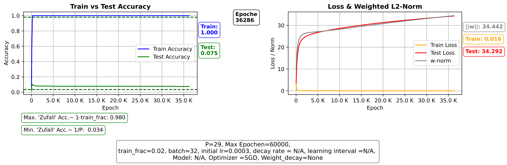 
*Abbildung 3: Ausgewählte Beispiel MLP ohne Embedding* 

<!-- "../" um zu dem Ornder oben zu wechseln-->
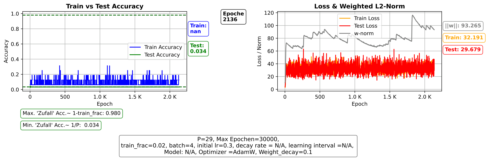 
*Abbildung 4: Ausgewählte Beispiel MLP ohne Embedding*

<!-- "../" um zu dem Ornder oben zu wechseln-->
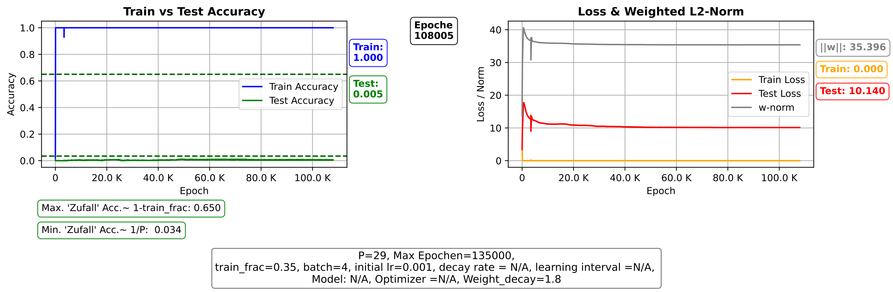 
*Abbildung 5: Ausgewählte Beispiel MLP ohne Embedding*

### Phase 2 – Notwendigkeit der Embeddings & Attention, für P = 29
Nach der Implementierung des Embeddings und Attention NN wirkten die ersten instabilen Generalisierungseffekte wie lokale Phasenfluktuationen – kurzzeitige Ordnungszustände, die noch nicht dauerhaft stabil waren. Checkpoints wurden dadurch zu einem essenziellen Werkzeug, um diese Übergangszustände beobachten und analysieren zu können.

- Erste Grokking-Anzeichen

- Instabilität → Checkpoints


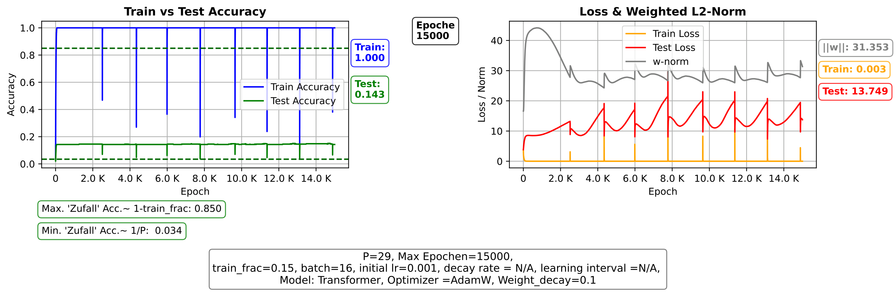 
*Abbildung 6: Ausgewählte Beispiel Attention mit Embedding, noch kein Grokking aber verbessere Test Accuracy mit "Sägezahn"-Strukture* 

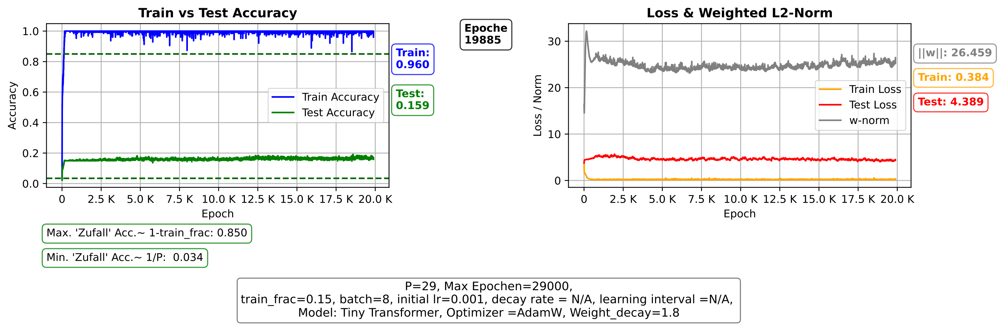 
*Abbildung 7: Ausgewählte Beispiel Attention mit Embedding, noch kein Grokking aber verbessere Test Accuracy mit "Sägezahn"-Strukture* 

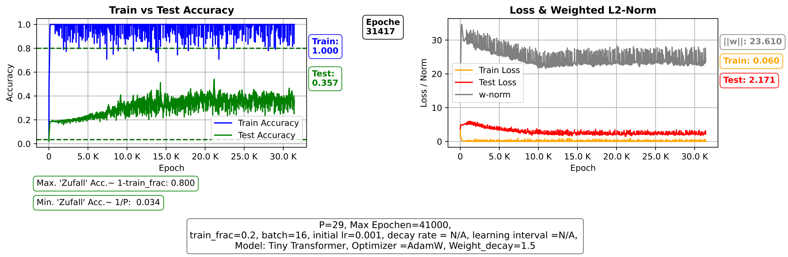 
*Abbildung 8: Ausgewählte Beispiel Attention mit Embedding, noch kein Grokking aber verbessere Test Accuracy mit "Sägezahn"-Strukture* 

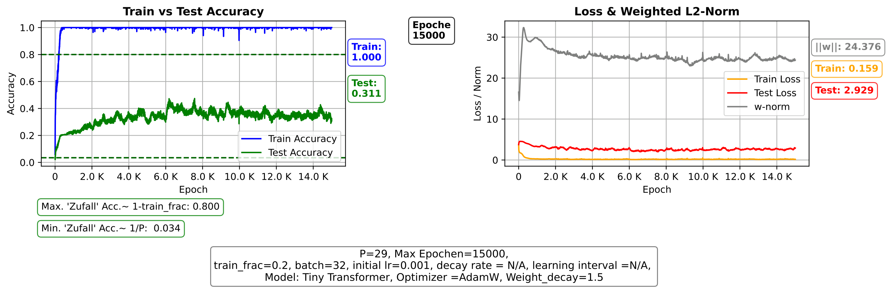 
*Abbildung 9: Ausgewählte Beispiel Attention mit Embedding, noch kein Grokking aber verbessere Test Accuracy mit "Sägezahn"-Strukture* 

### Phase 3 – Hybrid-Modell (Attention + MLP) für P = 29
Mit der Hybrid-Architektur begann sich erstmals ein reproduzierbares Trainingsmuster zu zeigen. Der Übergang zur Generalisierung wirkte nun weniger zufällig und eher wie das Überschreiten einer klaren kritischen Schwelle im Lernprozess. Jedoch gab es noch eine Beobachtung: Die Test-accuracy war noch 
nicht immer 100% und stagniert auf eine niedriger Wert.

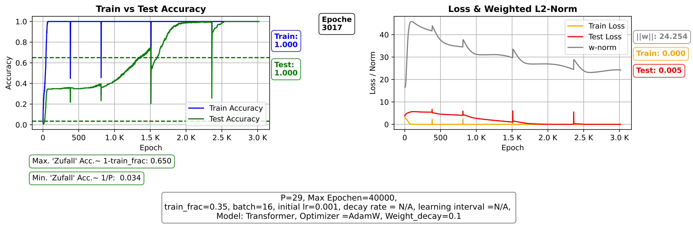 
*Abbildung 10: Ausgewählte Beispiel mit Embedding, Attention + MLP, Grokking sichtbar trotz Stagnierung/Instabilität der Konvergenz in späteren Epochen* 

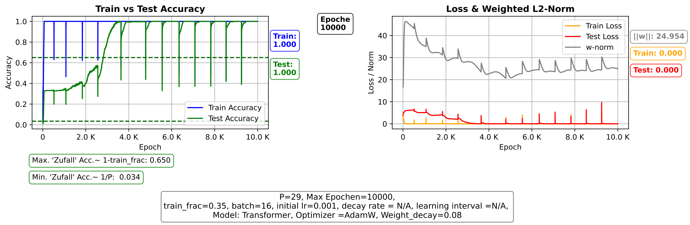 
*Abbildung 11: Ausgewählte Beispiel mit Embedding, Attention + MLP, Grokking sichtbar trotz Stagnierung/Instabilität der Konvergenz in späteren Epochen* 

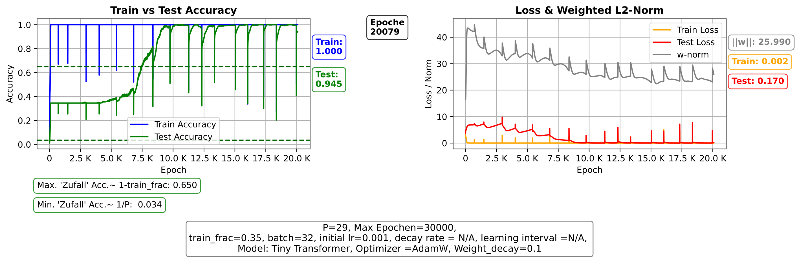 
*Abbildung 12: Ausgewählte Beispiel mit Embedding, Attention + MLP, Grokking sichtbar trotz Stagnierung/Instabilität der Konvergenz in späteren Epochen* 

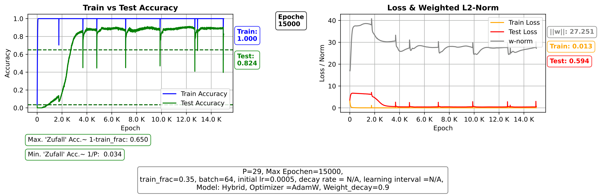 
*Abbildung 13: Ausgewählte Beispiel mit Embedding, Attention + MLP, Grokking sichtbar trotz Stagnierung/Instabilität der Konvergenz in späteren Epochen* 

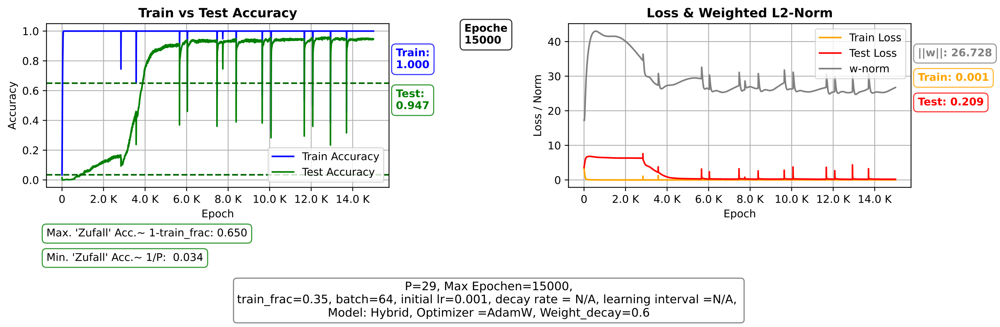 
*Abbildung 14: Ausgewählte Beispiel mit Embedding, Attention + MLP, Grokking sichtbar trotz Stagnierung/Instabilität der Konvergenz in späteren Epochen* 

### Phase 3.1 - Hybrid-Modell (Attention + MLP) + Einführung eines Schedulers für P = 29
Das war eine Hinweiss das Learningrate ab einer 
bestimmten Epoche noch angepasst werden müsste.  Zunächst habe ich es manuell versucht. Um die Konvergenz in der finalen Phase genauer zu stabilisieren, habe ich anschließend einen Scheduler in den Code eingefügt, um den *exponentiellen Zerfall der Lernrate* umzusetzen. 

```pyhton
lr_schedule = tf.keras.optimizers.schedules.ExponentialDecay(
    initial_learning_rate=1e-3,
    decay_steps=10000,
    decay_rate=0.9
)
```
Und Grokking war endlich mit Scheduler schön sichtbar

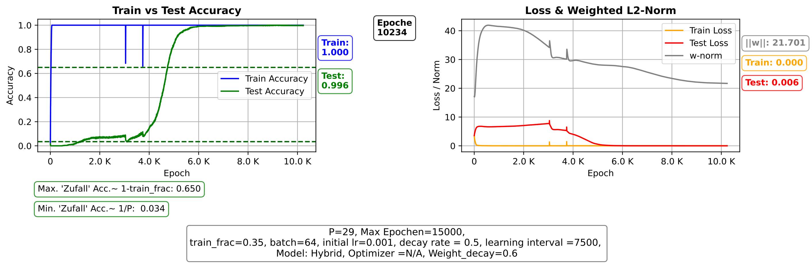 
*Abbildung 15: Grokking sichtbar P=29* 

### Phase 4 - Zurück zum P = 97: Auf der Suche nach den geigneten Rahmenbedingung
Nachdem das Hybridmodell (+ Scheduler) für P = 29 Grokking sichtbar war, wurde es als nächster Schritt für P = 97 trainiert. Zuvor mussten jedoch die geeigneten Rahmenbedingungen (Train-/Testdatensatz, Kalibrierung der Hyperparameter etc.) gefunden werden.

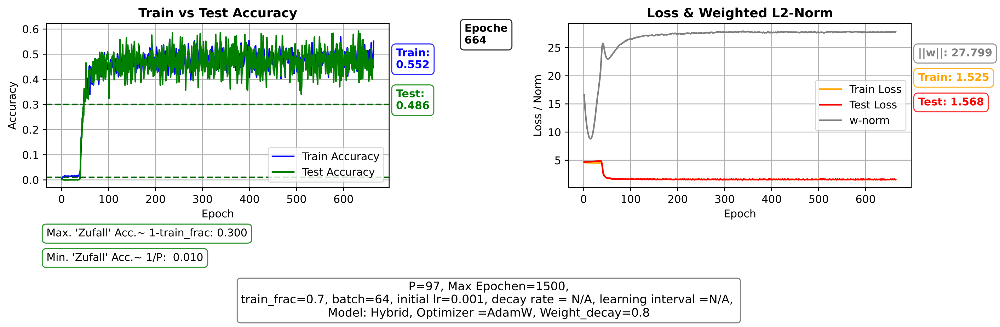 
*Abbildung 16: Ausgewählte Beispiel, auf der Suche nach Grokking, P=97* 

 
*Abbildung 17: Ausgewählte Beispiel, auf der Suche nach Grokking, P=97* 

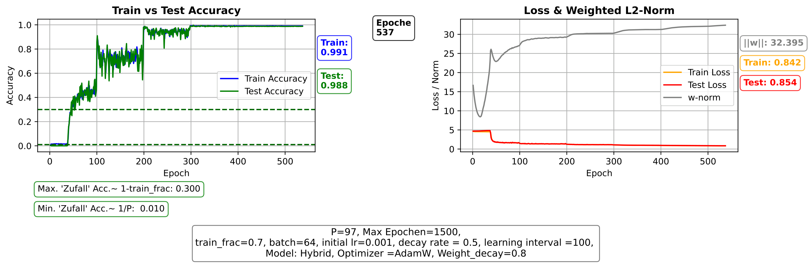 
*Abbildung 18: Ausgewählte Beispiel, auf der Suche nach Grokking, P=97* 

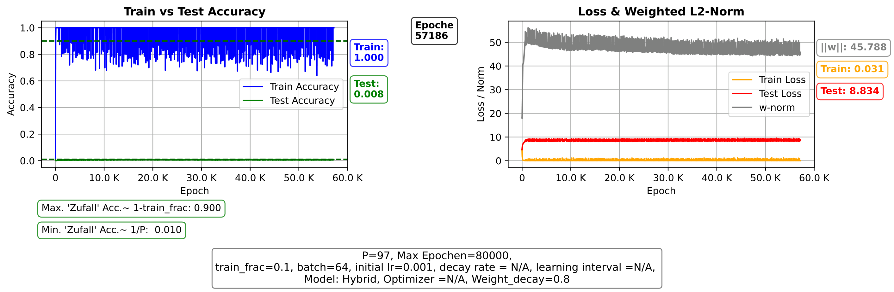 
*Abbildung 19: Ausgewählte Beispiel, auf der Suche nach Grokking, P=97* 

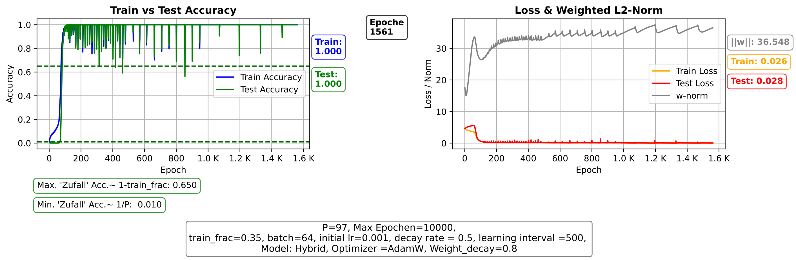 
*Abbildung 20: Ausgewählte Beispiel, auf der Suche nach Grokking, P=97* 

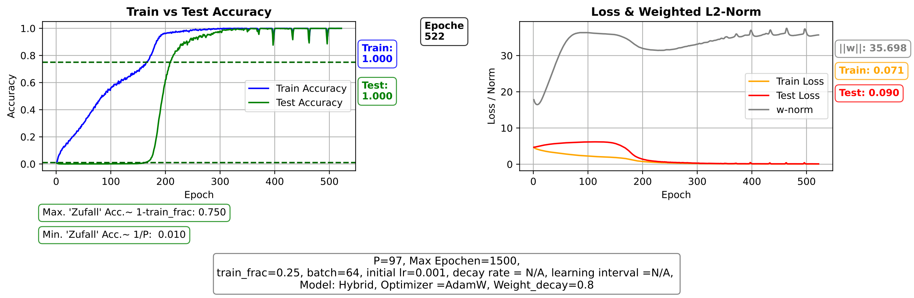 
*Abbildung 21: Ausgewählte Beispiel, auf der Suche nach Grokking, P=97* 

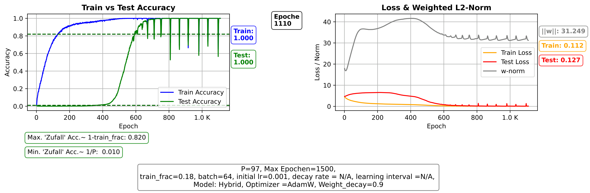 
*Abbildung 22: Ausgewählte Beispiel, auf der Suche nach Grokking, P=97* 

bis Grokking endlich sichtbar war 

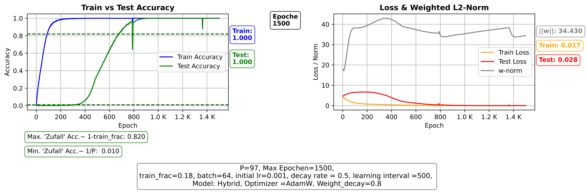 
*Abbildung 23: Grokking P=97* 

<!-- ===================================================== -->
## 10.  MultiStep Grokking Scheduler
Da, wie schon erwähnt, haben in obigem Abschnitt Phase 3.1, um das Rauschen und die Instabilität der Konvergenz der Test-Accuracy ab einer bestimmten, höheren Werte zu reduzieren, können wir den Scheduler von `Keras` einsetzen, der den Wert von `LR` anpasst. 

Als letzten Touch in diesem Projekt, weil wir uns etwas mehr Kontrolle über das Verhältnis des Wachstums von `LR` wünschen, habe ich einen Scheduler implementiert und als die Aufgabe einer spezialisierten Keras-Callback integriert, die die Generalisierungsphase (Grokking) durch adaptive Lernraten-Steuerung optimiert.


### Kernkonzept
Grokking-Kurven stagnieren oft auf hohen Plateaus. Der Scheduler agiert als "Phasen-Katalysator":
1. **Initialphase:** Hohe LR für schnelle Exploration der Gewichtslandschaft.
2. **Grokking-Phase:** Präzise LR-Senkung bei Stagnation (ab 90% Acc), um das Modell in schmale Minima zu zwingen.
3. **Stabilisierung:** Automatischer Stabilitäts-Check zur Vermeidung von "Sloshing" (Rauschen am Gipfel).

### Hyperparameter-Setup
Die Steuerung erfolgt über zentrale Konstanten im Skript-Header:

| Parameter | Standardwert | Beschreibung |
| :--- | :--- | :--- |
| `THRESHOLD` | `0.92` | Aktivierungsschwelle der Überwachung |
| `STOP_THRESHOLD` | `0.9999` | Ziel-Präzision für die Abschaltung |
| `PATIENCE` | `100` | Erlaubte Epochen ohne Verbesserung |
| `DECAY_RATE` | `0.9` | Faktor der LR-Reduktion |
| `MIN_LR` | `1e-6` | Sicherheitsuntergrenze (Sicherheitsnetz) |
| `BREITE_FENSTER` | `10` | Epochen für den Stabilitäts-Check |

###  Implementierungs-Logik
Der Kern der LR-Anpassung innerhalb der `on_epoch_end`-Methode:

```python
if test_acc >= self.threshold:
    if test_acc > self.best_acc:
        self.best_acc, self.wait = test_acc, 0  # Fortschritt
    elif self.wait >= self.patience:
        # Senkung nur bis zum Sicherheits-Limit (MIN_LR)
        new_lr = max(current_lr * self.decay_rate, self.min_lr)
        opt.learning_rate.assign(new_lr)
        self.wait = 0
```


Der Scheduler dokumentiert den Status direkt in der training_settings.txt.  Die Senkung der `LR` wird weiter durchgesetzt, bis entweder eine stabile Phase erreicht wird oder ein minimaler Sicherheitswert erreicht ist. Sobald eine stabile Phase erreicht ist oder der minimale Sicherheitswert erreicht wurde, wird die Überwachung deaktiviert und das Training läuft automatisch bis zum Ende weiter.

Unten sind zwei Plots der beiden Runs mit den oben in der Tabelle angegebenen Parametern, einmal mit und einmal ohne Scheduler. Die Verbesserung der Konvergenz der Test-Accuracy durch den Scheduler ist deutlich erkennbar und präsizer.


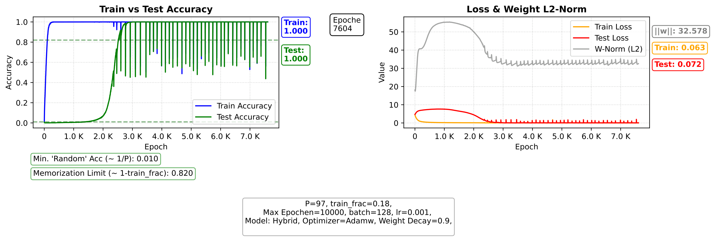 
*Abbildung 24: Grokking ohne Scheduler* 

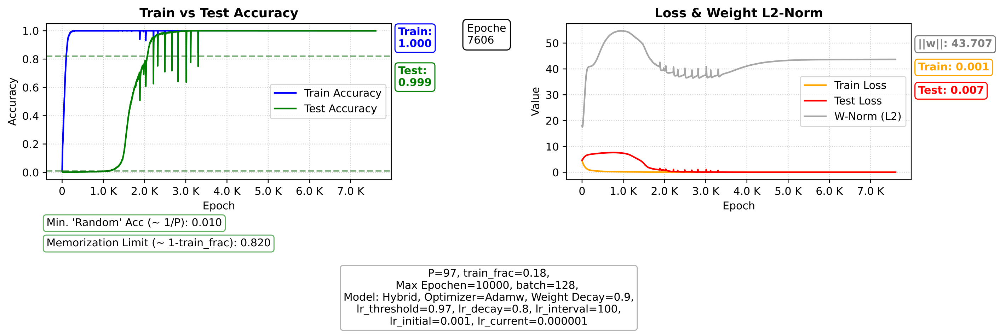 
*Abbildung 25: Grokking ohne Scheduler* 

Grokking_Experiment_P_97_Plot_Embedding_Attention_MLP_ohne_Scheduler_p0


<!-- ===================================================== -->
## 11. Engineering Lessons
### Tuning-Parameter
Die Sensitivität gegenüber Hyperparametern erinnerte stark an kritische Parameterbereiche in physikalischen Systemen. Kleine Änderungen konnten den Unterschied zwischen stabiler Memorization und plötzlicher Generalisierung ausmachen.

- Training/Test Ratio

- Weight Decay

- Batch Size

### Resume-Logik
Langzeittraining machte deutlich, dass Grokking kein kurzfristiger Trainingseffekt ist, sondern ein emergenter Prozess über extrem viele Iterationen hinweg. Die Fähigkeit, Experimente exakt fortzusetzen, wurde dadurch zu einer zentralen Voraussetzung für reproduzierbare Forschung.

```python
model = tf.keras.models.load_model(latest_checkpoint)
initial_epoch = last_epoch
```
<!-- TODO: Abbildung 5 – Konvergenzvergleich -->

<!-- ===================================================== -->
## 12. Ausblick
Viele der zukünftigen Ideen entstehen direkt aus offenen Fragen während der Experimente – insbesondere aus Momenten, in denen das Modell scheinbar "unerwartet" strukturelle Ordnungen entwickelte. Die Verbindung zwischen mechanistischer Interpretierbarkeit und physikalischer Modellierung bleibt dabei ein zentraler Leitfaden.


- Mechanistic Interpretability

- Skalierung auf größere Transformer

- Software-Architektur im ML Engineering

<!-- ===================================================== -->
## 13. Fazit
Die Experimente vermittelten mir den Eindruck, dass neuronale Netze unter starkem strukturellem Druck tatsächlich zu einer Form algorithmischer Kompression tendieren. Der plötzliche Übergang von Memorization zu Generalization wirkte dabei weniger wie ein Zufall und mehr wie ein echter Phasenwechsel im Lösungsraum.
Unter ausreichend Regularisierung und Trainingszeit können neuronale Netze -zumindest bei diesem Beispiel- von statistischer Korrelation zu mathematischer Struktur übergehen.

