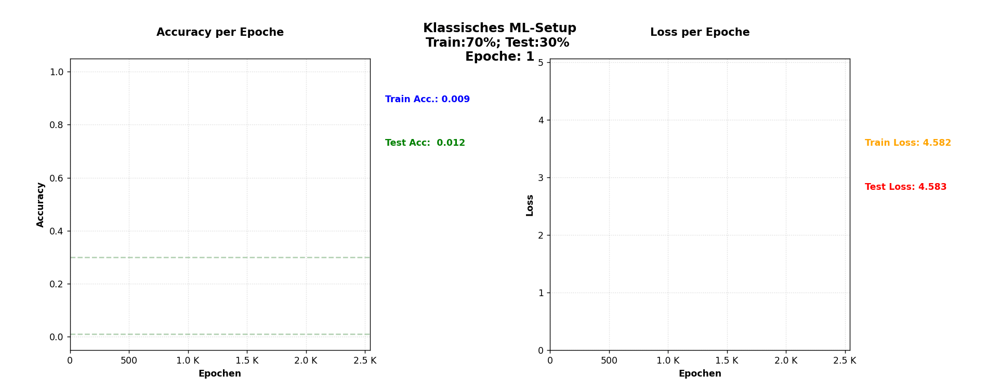
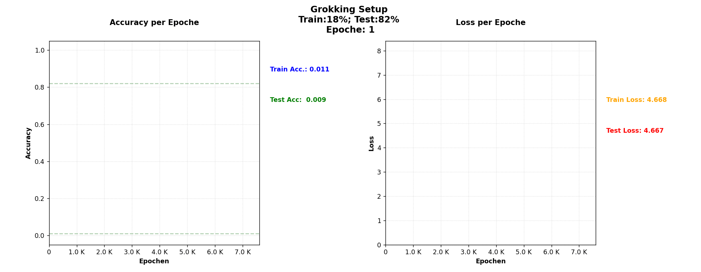

# Visualisierung des Lernens kleiner neuronaler Netze bei modularer Addition: "Grokking" Experiment 

**Melanie MALDONADO**

Dieses Projekt ist eine explorative Untersuchung des Phänomens **"Grokking"** – jenen Moment, in dem ein neuronales Netz mit wenige Training-Datensätze von reinem Auswendiglernen (*Memorization*) zu echter mathematischer Generalisierung übergeht. Für eine detaillierte Darstellung aller Experimente, Plots, Trainingsmetriken und Code-Snippets siehe [```Analysis.md```](https://github.com/MelanieM2/Grokking-Project/blob/main/Analysis.md) .

> Das Projekt entstand als Abschlussprojekt im Rahmen der Ausbildung [Data Science und Business Analytics – WIFI Vorarlberg](https://www.vlbg.wifi.at/Kursbuch/kurs_detail.php?eKey=Eg&eTypNr=1024&eWJ=)  unter der Leitung von [Prof. Dr.-Ing. Jürgen Brauer](https://www.juebrauer.org/).


### Warum ist Grokking wichtig?
Neuronale Netze können Trainingsdaten sehr schnell auswendig lernen, ohne die zugrunde liegende mathematische Struktur zu erfassen. 
In klassischen Machine-Learning-Setups wird häufig eine Train/Test-Aufteilung von etwa 70/30 % verwendet. In solchen Szenarien konvergieren Modelle meist schnell, da sie genügend Beispiele sehen, um statistische Muster effizient zu approximieren.

 
*Illustration eines ML-Setup: 70% Trainings/ 30% Testsdatensatz, siehe Abbildung 1 in ```Analysis.md```*

Hier wird die gegenseitige Situation betrachtet: Durch eine drastische Reduktion der Trainingsdaten (bei Systemen, hinter denen sich eine bestimmte algorithmische Struktur verbirgt) wird das Modell gezwungen, über reine Memorisierung hinauszugehen und die zugrunde liegende Regel zu abstrahieren. Grokking beschreibt eine überraschende Dynamik bei solchen Systemen: Das Modell scheint über viele Epochen in reiner Memorisierung gefangen zu sein, bevor es plötzlich einen abrupten Übergang zur Generalisierung zeigt!


*Grokking P=97, siehe Abbildung 23 in ```Analysis.md```* 

Dieses Projekt untersucht systematisch:
* **Wann und wie** Modelle wirklich generalisieren.
* Die Rolle der **Trainingsdaten-Ratio** (ca. 18–35 %).
* Die Wirkung von **L2-Regularisierung** auf das Lernverhalten.
* **Strukturelle Veränderungen** im Parameterraum, interpretiert als Phasenübergänge.


## Forschungsfokus

*   **Lernkurven:** Analyse der Divergenz zwischen Trainings- und Test-Accuracy.
*   **Gewichts-Dynamik:** Untersuchung der L2-Norm als Indikator für strukturelle Reorganisation.
*   **Interpretability:** Visualisierung des "AHA-Moments" beim Erlernen modularer Arithmetik.
*   **Experimente & Ergebnisse:** Kompakte Darstellung der wichtigsten Beobachtungen inkl. Grafiken.

## Tech Stack

| Komponente | Technologie |
| :--- | :--- |
| **Sprache** | Python 3.12.10 |
| **Frameworks** | TensorFlow, NumPy, Pandas |
| **Visualisierung** | Matplotlib (inkl. Animationen & ipympl) |
| **Reporting** | PyPDF (automatisierte Analysen) |

---

## Installation & Setup

Befolgen Sie diese Schritte, um die Umgebung lokal einzurichten:

### 1. Repository klonen
```bash
git clone https://github.com/MelanieM2/Grokking-Code/

```

### 2. Virtuelle Umgebung erstellen
#### Windows:
```bash
python -m venv venv
.\venv\Scripts\activate
```

#### Mac/Linux:
```bash
python3 -m venv venv
source venv/bin/activate
```

### 3. Abhängigkeiten installieren
```bash
pip install -r requirements.txt
```


## Projektstruktur

```text
├── src/                    # Kern-Logik & Trainings-Skripte
│   ├── Grokking_training_Embedding_Attention_und_MLP.py
│   ├── Grokking_training_baseline_MLP.py
│   └── Grokking_training_Embedding_Attention_und_MLP_mit_auto_LR_Scheduler.py
├── notebooks/              # Explorative Analysen & Visualisierungen
├── runs/                   # Lokale Logs, Checkpoints, Trainingsmetriken
└── plots/                  # Exportierte Visualisierungen der Grokking-Effekte
```


### Details zu den Skripten (`src/`)

* **`Grokking_training_Embedding_Attention_und_MLP.py`**: Das Hauptskript des Projekts zur Untersuchung der Grokking-Effekte.
* **`Grokking_training_baseline_MLP.py`**: Initiales Baseline-MLP Modell zum Vergleich der Lernfortschritte.
* **`Grokking_training_Embedding_Attention_und_MLP_mit_auto_LR_Scheduler.py`**: Erweiterte Version mit automatischem Learning-Rate-Scheduler zur Stabilisierung des Trainingsprozesses.

----
## Experimente & Ergebnisse

### Standard Training Datensatz ~ 70% (Testing Datensatz ~ 30%)

*   **Schnelle Konvergenz:** Die Trainings-Accuracy erreicht sehr schnell hohe Werte.
*   **Früher Anstieg:** Die Test-Accuracy steigt zeitnah mit der Trainings-Accuracy an.
*   **Mustererkennung:** Das Modell lernt primär statistische Muster der Daten.
*   **Kein Grokking:** Es tritt keine verzögerte Generalisierung auf.

> **Interpretation:** Das Modell approximiert die Trainingsverteilung effizient, ohne tiefere strukturelle Repräsentationen zu entwickeln. Bei dieser Datenmenge ist reines Memorizing ausreichend, um auch auf Testdaten gut abzuschneiden.


---


### Grokking-Regime: Training Datensatz ~ 18–35% 

*   **Lange Memorization-Phase:** Das Modell verharrt über einen langen Zeitraum im Zustand des reinen Auswendiglernens.
*   **Divergenz der Accuracy:** Während die Trainings-Accuracy früh hohe Werte erreicht, bleibt die Test-Accuracy lange Zeit nahe Null.
*   **Abrupter Generalisierungssprung:** Nach vielen Epochen erfolgt ein plötzlicher Anstieg der Test-Accuracy auf nahezu 100 %.

> **Interpretation:** Dieser abrupte Übergang wird als **Phasenübergang** in den Modellparametern interpretiert. Das Netz "findet" erst spät eine mathematisch konsistente Lösung, die über die Trainingsdaten hinaus gültig ist.


---

### Weight Norm-Dynamik

* **Indikator für Struktur:** Beobachtung von Oszillationen und abrupten Reorganisationen der Gewichte.
* **Strukturelle Reorganisation:** Diese Dynamik dient als Indikator für interne strukturelle Veränderungen im Modell, während es die mathematische Logik der modularen Arithmetik erschließt.

---
## Modellarchitektur

*   **Pipeline:** `Embedding` → `Attention` → `MLP` → `Output (mod P)`
*   **Repräsentation:** Verwendung diskreter Repräsentationen anstelle von einfacher Skalierung.
*   **Mechanismus:** Relationale Modellierung via **Attention-Layer**.
*   **Regularisierung:** **L2-Regularisierung** als notwendige Bedingung für das Auftreten von Grokking.
*   **Performance:** Effizient implementiert und vollständig **CPU-trainierbar**.

---

## Modell & Trainingsstrategie

Für die Experimente wurden verschiedene neuronale Netzwerke eingesetzt, um die Lernprozesse bei modularer Addition zu untersuchen:

- **Baseline MLP:** Klassisches Multi-Layer Perceptron zur Überprüfung, ob einfache vollvernetzte Layer die algebraische Struktur erfassen können.  
- **Embedding + MLP:** Diskrete Zahlen als Vektoren repräsentiert, kombiniert mit Dense-Layern, um zyklische Strukturen besser abzubilden.  
- **Hybrid-Modell (Embedding + Attention + MLP):** Die Attention-Schicht erkennt relationale Abhängigkeiten zwischen Operanden, während das MLP diese Struktur in die endgültigen Vorhersagen transformiert.  

**Automatischer Learning-Rate-Scheduler:**  
Um die Präzision der Test-Accuracy in der kritischen Grokking-Phase zu erhöhen, wurde ein exponentieller Scheduler implementiert. Dieser reduziert die Lernrate automatisch, sobald die Trainingsmetriken eine Stabilisierung anzeigen, und verhindert so unnötiges Rauschen, das die Generalisierung verzögern könnte.  

> Kombination von Architekturen + Scheduler erlaubt es, den „AHA-Moment“ der Generalisierung zuverlässig zu beobachten und visuell darzustellen.


---

## Erkenntnisse

- **Daten-Abhängigkeit:** Generalisierung ist stark sensitiv gegenüber der Trainingsdaten-Ratio.
- **Regularisierung:** L2-Regularisierung wirkt als struktureller Druckmechanismus und begünstigt kompakte, generalisierende Repräsentationen.
- **Architektur-Effekt:** Reine MLP-Modelle mit skalierter Eingabe zeigen unter identischen Bedingungen kein stabiles Grokking.
- **Dynamik:** Die Trainingsverläufe lassen sich als hochdimensionale Phasenübergänge interpretieren.

- **Embedding:** Ermöglicht eine lernbare Repräsentationsgeometrie diskreter Zahlenräume.
- **Attention:** Unterstützt das Erfassen relationaler algebraischer Strukturen.
- **MLP:** Konsolidiert extrahierte Merkmale zu einer stabilen funktionalen Abbildung.
- **Learning-Rate-Scheduler:** Stabilisiert die Konvergenz in der späten Trainingsphase und erhöht die Präzision der Generalisierung.

---

## Weitere Ressourcen

- **Detaillierte Projektanalyse:** Für tiefere Einblicke in die Projektlogik, Trainingsmetriken, Plots und Code-Snippets siehe die Dokumentation: [Analysis.md](Analysis.md)  
- **Wissenschaftliche Referenzen:**  
  - Power et al. (2021): ["Grokking: Generalization Beyond Overfitting on Small Algorithmic Datasets. Power, A., et al. 2022."](https://arxiv.org/abs/2105.11041)  
  - Nanda et al. (2023): ["Progress Measures For Grokking Via Mechanistic Interpretability Nanda et al. 2023"](https://arxiv.org/abs/2301.06583)  
  - Youtube Video von Welch Labs: [The most complex model we actually understand](https://www.youtube.com/watch?v=D8GOeCFFby4)

---

## Über die Autorin

Ich bin Mathematikerin mit Forschungsschwerpunkten mit den Schwerpunkten Mathematische Physik, Differenzialgeometrie und globale Analyse auf Mannigfaltigkeiten. Derzeit erweitere ich meine Kompetenzen in den Bereichen Deep Learning und Data Science. Außerdem interessiere ich mich für Wissenschaftskommunikation und die Anwendung von generativer KI in den Bereichen Bildung und MINT.

**Melanie MALDONADO, Dr.in. rer. nat.**